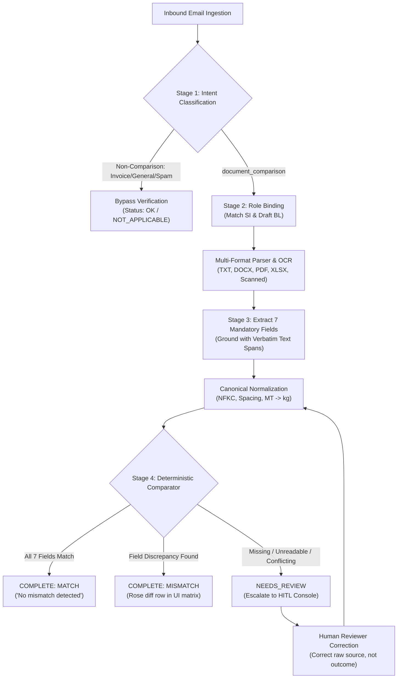

# Shipping Document Verification System

[](specs/05_TEST_PLAN.md)
[](tests/fixtures/)
[](scripts/verify_contracts.py)
[](frontend/)
[](app.py)

An AI-assisted shipping document verification and discrepancy audit platform that automates inbound email classification, extracts critical shipment data from Shipping Instructions (SI) and Draft Bills of Lading (BL), performs deterministic cross-field comparisons, and escalates uncertain cases for Human-in-the-Loop (HITL) review.

---

## 🚀 Live Demo & Endpoints

| Resource | URL | Description |
| :--- | :--- | :--- |
| **Frontend Web Console** | [hackaton-the-farmer-1.onrender.com](https://hackaton-the-farmer-1.onrender.com/) | React single-page review dashboard & 4-column diff matrix |
| **Backend REST API** | [hackaton-the-farmer.onrender.com](https://hackaton-the-farmer.onrender.com) | FastAPI backend service |
| **Swagger API Docs** | [hackaton-the-farmer.onrender.com/docs](https://hackaton-the-farmer.onrender.com/docs) | Interactive OpenAPI documentation & schema explorer |

---

## 💡 The Core Idea: Hybrid AI + Deterministic Architecture

Shipping document verification cannot tolerate hallucinated results or opaque black-box decisions. This platform combines the semantic power of AI with the mathematical guarantees of deterministic software:

```
┌──────────────────────────────────────────────┐     ┌──────────────────────────────────────────────┐
│            AI on Demand (Interpretation)     │     │      Deterministic Rules (Verification)      │
├──────────────────────────────────────────────┤     ├──────────────────────────────────────────────┤
│ • Classifies unstructured email intent       │     │ • Text formatting & NFKC Unicode cleanup     │
│ • Binds ambiguous document filenames & roles │     │ • Metric Ton -> Kilogram mathematical math   │
│ • Recovers unreadable/scanned PDFs via OCR   │     │ • Strict 7-field exact equality checks       │
│ • Extracts complex table layout candidates   │     │ • Final MATCH / MISMATCH decisions           │
└──────────────────────────────────────────────┘     └──────────────────────────────────────────────┘
```

> **Key Rule**: The LLM **never** decides whether two shipment values match. Equality and discrepancy decisions are 100% deterministic, reproducible, and verifiable.

---

## 🔄 End-to-End Pipeline



---

## 📋 The 7 Mandatory Comparison Fields

The comparison engine cross-examines exactly seven mandatory shipment attributes:

| Field | Canonical Type | Normalization & Verification Standards |
| :--- | :---: | :--- |
| **`shipper`** | Text | NFKC normalization, whitespace collapsed, uppercase, punctuation trimmed. |
| **`consignee`** | Text | Multiline corporate address blocks preserved with continuous line spans. |
| **`notify_party`** | Text | Resolved against consignee references (`"SAME AS CONSIGNEE"`). |
| **`port_of_loading`** | Text | Port name with UN/LOCODE identifier preserved (`"SHANGHAI (CNSHA)"`). |
| **`port_of_discharge`** | Text | Destination port name with UN/LOCODE identifier preserved (`"ROTTERDAM (NLRTM)"`). |
| **`container_count`** | Integer | Words converted to numbers (`"Three (3)"` $\rightarrow$ `3`), multi-size manifest summation. |
| **`gross_weight_kg`** | Decimal | Exact mathematical conversion (`22 MT` $\rightarrow$ `Decimal("22000")`), zero binary float drift. |

---

## 🛡️ Core Reliability & Safety Invariants

### 1. Tri-State Integrity Model
Verification produces three mutually exclusive outcomes:
- **`MATCH`**: All 7 mandatory fields are reliable and match 100%.
- **`MISMATCH`**: All 7 mandatory fields are reliable, and $\ge 1$ discrepancy is detected.
- **`null` / `UNRESOLVED`**: If any field is missing, unreadable, or conflicting, `mismatch_detected` remains `null`. The engine **never** emits a false "clean match" on incomplete information.

### 2. Verbatim Evidence Grounding
Every extracted value is bound to a `FieldEvidence` record with:
- Exact verbatim quote snippet.
- Page number / table coordinate metadata.
- Parent document ID.
*Self-reported LLM confidence is treated as diagnostic only and can never bypass evidence validation.*

### 3. Partial Work Preservation
When an escalation occurs (e.g., missing weight), the 6 matching fields are saved in `partial_result.comparisons`. Operators only need to correct the single problematic item without re-verifying already reliable data.

### 4. Concurrency-Safe Human Review
Review mutations (`POST /audit/{id}/review`) require an `expected_revision` parameter. If another operator saves changes first, the server returns **HTTP 409 Conflict**, preventing silent overwrites while preserving the reviewer's unsubmitted draft in the UI.

### 5. Safe Export Gate (`EXPORT_BLOCKED`)
Evaluation export (`GET /submission`) strictly enforces Safety Invariant DC-08: If any case remains in `NEEDS_REVIEW`, export is blocked with **HTTP 409**, detailing the exact blocking cases with direct links to resolve them.

---

## 🧪 Live Demo Cases (UAT Scenarios)

The deployed live demo contains four synthetic, representative scenarios:

| Case ID | Inbound Context | Pipeline State | Discrepancies / Reason | Reviewer Action in Console |
| :--- | :--- | :---: | :--- | :--- |
| **`uat-demo-match`** | Standard SI & Draft BL attached | `COMPLETE`<br>`MATCH` | None (`No mismatch detected`) | View green comparison matrix, inspect verbatim evidence drawer |
| **`uat-demo-mismatch`** | SI: 3 containers<br>BL: 4 containers | `COMPLETE`<br>`MISMATCH` | `container_count` differs (`3` vs `4`) | Prominent rose diff row displays side-by-side values and evidence |
| **`uat-demo-review`** | SI missing Gross Weight value | `NEEDS_REVIEW`<br>`null` | `missing_required_value`<br>(`gross_weight_kg`) | 6 matching fields preserved; enter weight in tabbed form $\rightarrow$ instant recompute to `MATCH` |
| **`uat-demo-general`** | Vessel sailing schedule inquiry | `COMPLETE`<br>`NOT_APPLICABLE` | None (Non-comparison email) | Classification bypasses SI/BL verification; records as general inquiry |

---

## 📊 Verification Scorecard

The codebase is governed by rigorous automated CI and regression suites:

| Suite | Scope | Target | Result |
| :--- | :--- | :---: | :---: |
| **Backend Pytest Suite** | Unit, contract, regression, security & E2E tests | 100% | **246 passed (0 failures)** |
| **AI Fixture Governance** | Atomic payloads, retry budgets, bounding boxes | 53 payloads | **53 / 53 passed** |
| **Review Fixture Governance** | Recomputation, optimistic locking, tri-state rules | 48 payloads | **48 / 48 passed** |
| **Frontend Unit Tests** | Component rendering, accessibility & modals | 9 tests | **9 / 9 passed** |
| **Frontend Production Build** | Vite production bundle compilation | Zero TS errors | **PASS (`tsc -b && vite build`)** |
| **Contract Synchronization** | FastAPI OpenAPI schema vs. TypeScript types | 1:1 sync | **PASS (`UI-CT-001`)** |
| **Evaluation Bundle Immutability** | Read-only evaluation dataset integrity | Zero git diff | **PASS (100% untouched)** |

---

## 🔌 API Endpoints Summary

```text
GET  /                          Dynamic service health & live audit summary metrics
GET  /health                    Readiness & liveness check
GET  /audit                     Query cases (filter by state, outcome, category)
GET  /audit/{email_id}          Retrieve full audit record, document metadata & evidence
POST /audit/{email_id}/review   Submit targeted human review correction with revision lock
GET  /submission                Export official evaluation JSON (blocked if cases remain unresolved)
POST /verify                    Ad-hoc on-demand verification payload
```

---

## 💻 Local Development Setup

### 1. Prerequisites
- Python 3.12+
- Node.js 20+ & npm

### 2. Backend Setup
```bash
# Clone the repository
git clone https://github.com/Tofui03/hackaton--the-farmer.git
cd hackaton--the-farmer

# Create and activate virtual environment
python -m venv .venv
source .venv/bin/activate  # On Windows: .venv\Scripts\activate

# Install dependencies
pip install -r requirements.txt

# (Optional) Enable UAT demo seed data for live UI testing
# Windows PowerShell:
$env:SDOC_UAT_DEMO_SEED="1"
# Linux / macOS:
export SDOC_UAT_DEMO_SEED=1

# Start the API server
uvicorn app:app --reload --port 10000
```
*API will run at `http://localhost:10000` with Swagger docs at `http://localhost:10000/docs`.*

### 3. Frontend Setup
```bash
cd frontend

# Install dependencies & run development server
npm install
npm run dev
```
*Frontend console will run at `http://localhost:5173`.*

### 4. Running the Verification Suite
```bash
# Run all 246 backend tests
python -m pytest tests -q

# Run frontend tests & build
npm --prefix frontend run test
npm --prefix frontend run build

# Run one-command deadline verification harness
powershell -ExecutionPolicy Bypass -File .\scripts\verify_deadline.ps1
```

---

## 📁 Repository Structure

```text
├── app.py                     # FastAPI entrypoint, lifespan startup hook & static mount
├── render.yaml                # Render deployment blueprint
├── requirements.txt           # Locked Python dependencies
│
├── frontend/                  # React 18 + Vite + Tailwind CSS Console
│   ├── src/components/        # ComparisonMatrix, OutcomeBadge, EvidenceDrawer, ConflictModal
│   └── src/views/             # CaseQueueView, ReviewWorkspaceView
│
├── src/
│   ├── adapters/              # Evaluation submission schema mapping
│   ├── api/                   # REST API routes & latency timing middleware
│   ├── comparator/            # Deterministic 7-field comparison engine
│   ├── demo/                  # Environment-gated UAT demo seed generator
│   ├── hitl/                  # Escalation engine & human review mutation service
│   ├── llm/                   # Provider-agnostic AI adapters, retries & schemas
│   ├── models/                # Strict Pydantic v2 data contracts
│   ├── normalization/         # Unicode NFKC, text & metric unit normalizers
│   ├── parsers/               # Pluggable parsers (TXT, DOCX, PDF, XLSX) & usability validator
│   ├── pipeline/              # Stages 1–4 pipeline orchestration
│   └── store/                 # Thread-safe in-memory AuditStore
│
├── tests/                     # 246 automated tests (unit, regression, contract, security, E2E)
├── scripts/                   # Deadline verification, benchmark & contract sync scripts
├── specs/                     # Baselined specifications (Product, Architecture, UI, Contracts)
└── sdoc-hackathon-bundle/     # Immutable evaluation dataset (520 emails, 250 attachments)
```

---

## 📄 License

Built for the SDOC Hackathon. All rights reserved.
