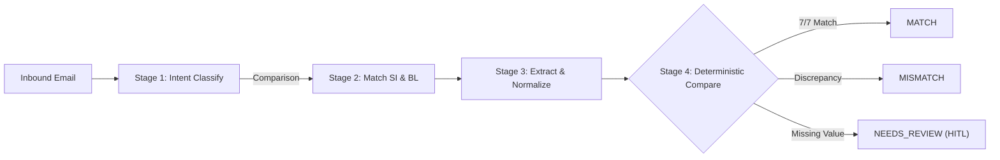

# Shipping Document Verification Platform (SDOC)

[](app.py)
[](frontend/)
[](tests/)
[](render.yaml)

An AI-assisted shipping document audit platform that automates inbound email classification, extracts critical shipping data from Shipping Instructions (SI) and Draft Bills of Lading (BL), performs **100% deterministic cross-field comparisons**, and escalates uncertain cases for Human-in-the-Loop (HITL) review.

---

## 🚀 Live Demo & Endpoints

| Service | Link | Description |
| :--- | :--- | :--- |
| **Web Console (UI)** | [hackaton-the-farmer-1.onrender.com](https://hackaton-the-farmer-1.onrender.com/) | Live Dual-Axis cinema audit console (Light/Dark mode) |
| **REST API** | [hackaton-the-farmer.onrender.com](https://hackaton-the-farmer.onrender.com) | FastAPI backend service with 250 UAT verification cases |
| **Swagger Docs** | [hackaton-the-farmer.onrender.com/docs](https://hackaton-the-farmer.onrender.com/docs) | Interactive OpenAPI schema explorer |

---

## 💡 Key Design: Hybrid AI + Deterministic Engine

- **AI on Demand**: Classifies inbound email intent, resolves document roles (SI vs. BL), and handles OCR for scanned files.
- **Deterministic Comparator**: **The LLM never decides matches.** All 7 field comparisons (Unicode NFKC, units, container count, gross weight) use mathematical exactness and emit reproducible `MATCH` / `MISMATCH` decisions.
- **Tri-State Guarantee**: `MATCH`, `MISMATCH`, or `NEEDS_REVIEW`. Incomplete documents never emit false-positive clean matches.


```mermaid
flowchart LR
    A["Inbound Email"] --> B["Stage 1: Intent Classify"]
    B -->|Comparison| C["Stage 2: Match SI & BL"]
    C --> D["Stage 3: Extract & Normalize"]
    D --> E{"Stage 4: Deterministic Compare"}
    E -->|7/7 Match| F["MATCH"]
    E -->|Discrepancy| G["MISMATCH"]
    E -->|Missing Value| H["NEEDS_REVIEW (HITL)"]
```

---

## 📋 The 7 Mandatory Comparison Fields

| Field | Type | Normalization Rule |
| :--- | :---: | :--- |
| `shipper` | Text | NFKC normalized, uppercase, whitespace collapsed |
| `consignee` | Text | Full address block preserved |
| `notify_party` | Text | Evaluated directly or resolved to `"SAME AS CONSIGNEE"` |
| `port_of_loading` | Text | UN/LOCODE preserved (e.g. `SINGAPORE (SGSIN)`) |
| `port_of_discharge` | Text | UN/LOCODE preserved (e.g. `ROTTERDAM (NLRTM)`) |
| `container_count` | Integer | Text-to-number conversion (`Three (3)` $\rightarrow$ `3`) |
| `gross_weight_kg` | Decimal | Exact mathematical conversion (`24.5 MT` $\rightarrow$ `24500.00 kg`) |

---

## ⚡ Quickstart

### 1. Clone & Setup Backend
```bash
git clone https://github.com/Tofui03/hackaton--the-farmer.git
cd hackaton--the-farmer

python -m venv .venv
source .venv/bin/activate  # Windows: .venv\Scripts\activate
pip install -r requirements.txt
```

### 2. Run API & Live Console (with 250 demo cases)
```bash
# Enable UAT seed data (default: 250 cases)
export SDOC_UAT_DEMO_SEED=1  # Windows PowerShell: $env:SDOC_UAT_DEMO_SEED="1"

# Start FastAPI server (serves both API and Web UI at /cases)
uvicorn app:app --reload --port 10000
```
- Open Web Console: **`http://localhost:10000/cases`**
- Open Swagger Docs: **`http://localhost:10000/docs`**

### 3. Run Automated Tests
```bash
.venv/bin/pytest -q  # 307 tests, 100% pass
```

---

## 📡 API Overview

| Method | Endpoint | Description |
| :--- | :--- | :--- |
| `GET` | `/audit` | Query cases (filter by state, outcome, category) |
| `GET` | `/audit/{email_id}` | Retrieve complete audit trail, document text & verbatim evidence |
| `POST` | `/audit/{email_id}/review` | Submit human review resolution with revision lock |
| `GET` | `/submission` | Export official evaluation JSON (blocked if unreviewed cases remain) |
| `POST` | `/verify` | Ad-hoc SI and BL verification |

---

## 📁 Repository Structure

```text
├── app.py                      # FastAPI entrypoint, lifespan startup hook & static SPA mount
├── docs/                       # Production frontend bundle served by Render at /cases
├── frontend/                   # React 18 + Vite + Tailwind CSS source code (Light & Dark mode)
├── src/
│   ├── api/                    # REST routes & latency timing middleware
│   ├── application/            # DDD Use cases & audit record assemblers
│   ├── comparator/             # Deterministic comparison strategies & engine
│   ├── demo/                   # UAT demo seed generator (250 high-density cases)
│   ├── domain/values/          # Domain Value Objects (GrossWeight, ContainerCount)
│   ├── hitl/                   # Escalation engine & human review mutation service
│   ├── models/                 # Strict Pydantic v2 data contracts
│   ├── parsers/                # Document parsers registry & factory (TXT, DOCX, PDF, XLSX)
│   └── pipeline/               # Stages 1–4 pipeline orchestrator
└── tests/                      # 307 automated unit, contract, regression, and E2E tests
```

---

## 📄 License

MIT License. Built for the SDOC Hackathon.
